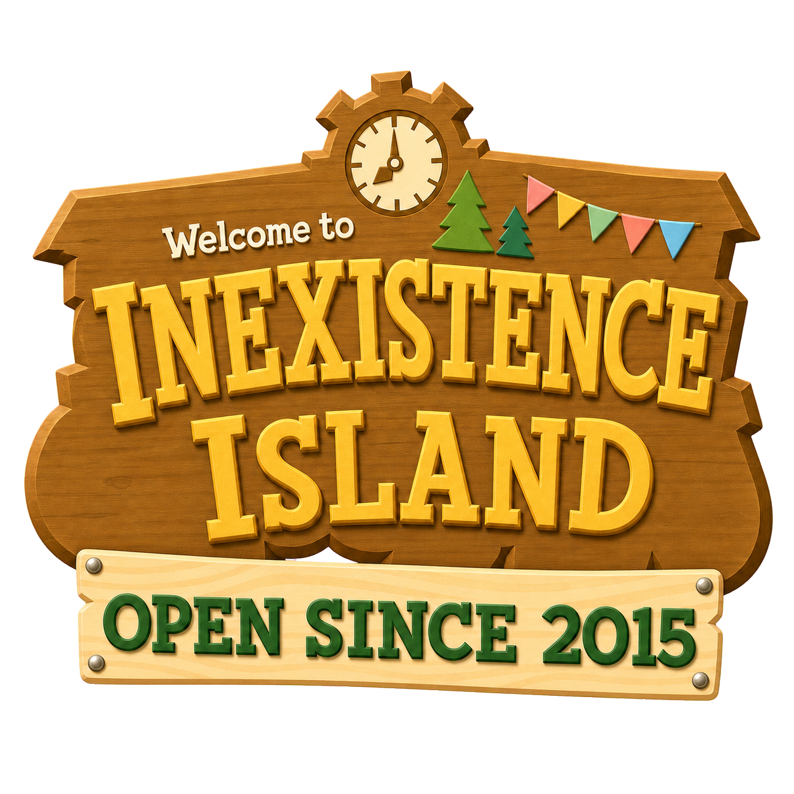

# INEXISTENCE

<p align="center">
  
</p>

个人博客，使用 Astro 构建，并通过 GitHub Pages 发布。

## 技术栈

- Astro 7 静态内容与路由
- React islands
- [animal-island-ui](https://github.com/guokaigdg/animal-island-ui) 1.3.0
- [Waline](https://waline.js.org/) 评论系统
- GitHub Actions + GitHub Pages

## 本地开发

```bash
npm install
npm run dev
```

开发服务器启动后，按照终端显示的地址在浏览器中预览。构建并检查：

```bash
npm run build
```

预览构建后的站点：

```bash
npm run preview
```

### 评论系统

文章评论与留言板使用 Waline。完整的架构、部署步骤、安全边界、环境变量和排障方法请参阅 [评论系统说明](docs/comments.md)。

## 写文章

文章存放在 `src/content/posts`，支持 `.md` 和 `.mdx` 文件。文件名会成为文章地址的一部分，建议使用简短的英文和连字符，例如：

```text
src/content/posts/my-new-post.md
```

对应的文章地址为：

```text
https://inexistence.github.io/posts/my-new-post/
```

新文章可以复制下面的模板：

```md
---
title: "文章标题"
description: "用一两句话介绍文章内容。"
publishDate: "2026-07-22"
category: "日志"
place: "in Guangzhou, China"
tags: ["生活", "记录"]
cover: "/assets/blog-images/example/cover.jpg"
draft: true
---

这里开始写正文。

## 小标题

支持标准 Markdown 语法，包括链接、图片、引用、列表和代码块。
```

字段说明：

| 字段 | 必填 | 说明 |
| --- | --- | --- |
| `title` | 是 | 文章标题 |
| `description` | 是 | 文章摘要，用于列表和页面描述 |
| `publishDate` | 是 | 发布日期，推荐使用 `YYYY-MM-DD` 格式 |
| `category` | 是 | 文章分类，例如“日志”“技术”“小说” |
| `place` | 否 | 写作地点，不需要时可以留空 |
| `tags` | 否 | 标签数组，例如 `["生活", "记录"]` |
| `cover` | 否 | 封面图片路径，不需要时可以留空 |
| `draft` | 否 | 是否为草稿，默认为 `false` |

建议新文章先设置 `draft: true`。草稿不会出现在生产页面、RSS 或 sitemap 中，确认完成后将其改为 `false` 再发布。

### 添加图片

把图片放在 `public/assets/blog-images` 下，例如：

```text
public/assets/blog-images/my-new-post/photo.jpg
```

在文章中使用从 `/assets` 开始的路径：

```md

```

需要满宽显示时可以使用：

```html

```

## 发布

发布前先在本地检查：

```bash
npm run build
```

构建成功后，提交并推送到 `master` 分支：

```bash
git add .
git commit -m "Add new post"
git push origin master
```

推送到 `master` 后，[GitHub Actions](https://github.com/inexistence/inexistence.github.io/actions) 会自动执行构建并部署到 GitHub Pages。部署成功后，站点会更新到：

<https://inexistence.github.io>

通常几分钟内可以完成。如果页面没有更新，请先检查 GitHub Actions 中最新一次工作流是否构建成功。

## 许可说明

本站使用的 `animal-island-ui` 组件遵循 [CC BY-NC 4.0](https://creativecommons.org/licenses/by-nc/4.0/) 许可，仅用于非商业个人博客。本站修改了主题变量和页面布局，并使用其提供的插画素材重新设计了岛屿场景。
