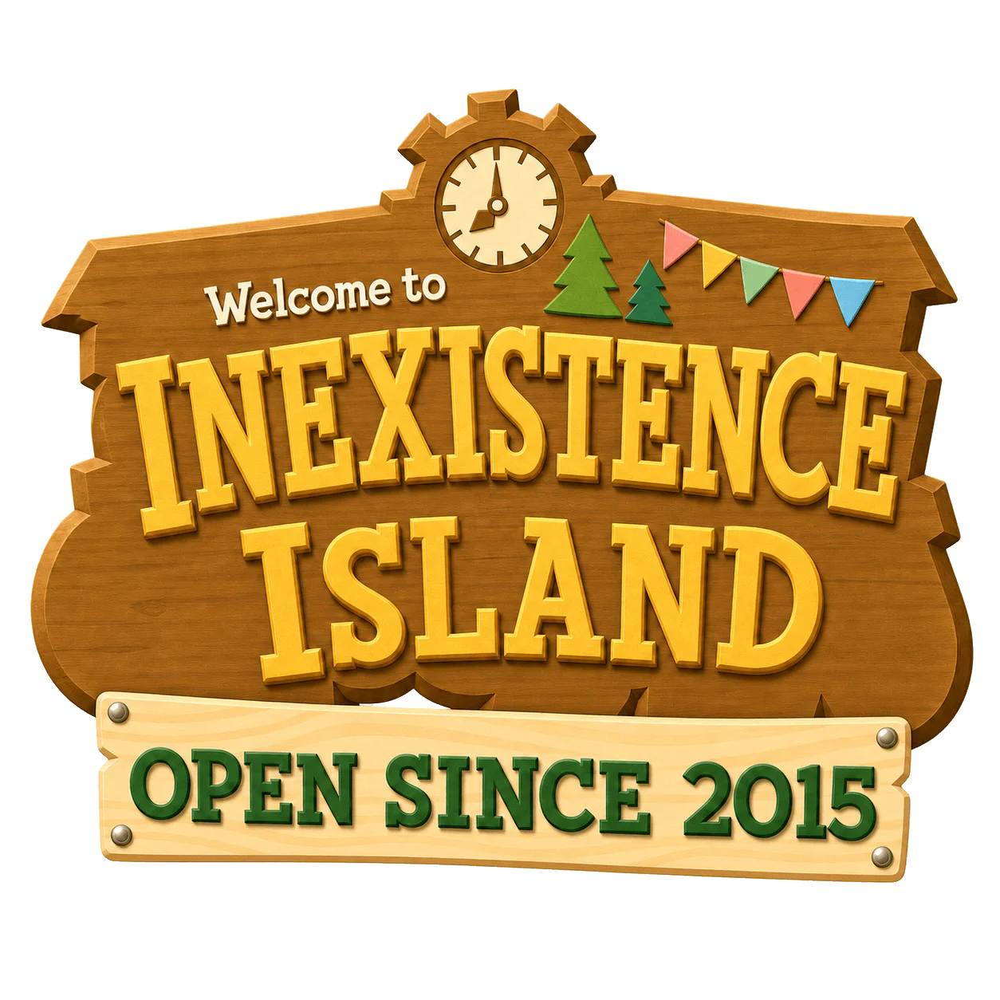

# 🏝️ INEXISTENCE

<p align="center">
  
</p>

<div align="center">
  个人博客，使用 Astro 构建，并通过 GitHub Pages 发布。
</div>

## 技术栈

- Astro 7 静态内容与路由
- React islands
- [animal-island-ui](https://github.com/guokaigdg/animal-island-ui) 1.3.0
- [Waline](https://waline.js.org/) 评论系统
- GitHub Actions + GitHub Pages

## 本地开发

```bash
npm install
npm run dev
```

开发服务器启动后，按照终端显示的地址在浏览器中预览。构建并检查：

```bash
npm run build
```

预览构建后的站点：

```bash
npm run preview
```

## 中文字体子集

`npm run dev` 和 `npm run build` 会自动准备字体。首次运行会在项目内创建 `.fonttools/` 并安装固定版本的 FontTools（需要 Python 3 与网络）；之后会复用缓存。

正文使用静态中文子集（`public/fonts/static/`，不提交）；修改 `src/` 中的文案会自动重建 400、500、700 三个字重。Waline 评论字体分块已提交在 `public/fonts/comment/`，冷启动只需校验指纹与文件哈希，不必重新子集化。

若改动了评论字体生成策略或源字体，本地运行 `npm run fonts:ensure`（或 `npm run fonts:vendor-comment`）后，把更新后的 comment 产物与 `manifest-fragment.json` 一并提交。CI 开启 `STRICT_COMMENT_FONT_VENDOR`，过期未提交会失败。细节见[字体子集技术方案](docs/font-subsetting.md)。

## 组件库按需样式

本站不会引入 `animal-island-ui` 的全量 CSS；新增或移除组件时，需要同步更新 `src/styles/animal-island-components.css`。`npm run styles:verify` 会检查源码组件、组件样式清单和主题变量是否一致，并会在开发、检查与构建前自动运行。裁剪逻辑和完整维护流程见[组件库样式维护说明](docs/animal-island-styles.md)。

## 页面样式组织

`src/styles/global.css` 仅存放全站字体与变量、重置与布局基础、导航/页脚等共享样式，以及跨页面的响应式覆盖。页面或功能专属样式应由对应页面直接导入，当前分工如下：

- `home.css`：首页的岛屿旅程与首页 Hero；
- `collection-pages.css`：归档、分类及这些页面共用的插画 Hero；
- `post.css`：文章页的头部、目录、正文和相邻文章导航；
- `comments.css`：文章评论与留言板使用的 Waline 外观；
- `rag-labs.css`：RAG 文章中的交互实验台。

新增页面时，优先新建或复用对应的页面样式文件，并在页面的 frontmatter import 区直接导入。只有确实被多个页面共同使用的规则，才放回 `global.css`。

## 开发与维护文档

- [设计规范](DESIGN.md)：新增页面、组件与视觉调整的基准；
- [性能与响应式图片优化](docs/responsive-images.md)：素材、响应式候选图与首屏资源策略；
- [中文字体子集技术方案](docs/font-subsetting.md)：字体生成、产物与构建校验；
- [组件库样式维护说明](docs/animal-island-styles.md)：`animal-island-ui` CSS 裁剪与校验；
- [前端运行时与 Hydration 维护](docs/frontend-runtime.md)：island 时机、站内导航与动效回退；
- [RSS 订阅说明](docs/rss.md)：订阅源生成、文章收录规则与验证方式；
- [岛屿展厅维护](docs/exhibition-maintenance.md)：摄影展内容、作品台词、图片隐私与发布检查；
- [评论系统说明](docs/comments.md) 与 [评论系统维护手册](docs/comment-maintenance.md)：架构、跨仓库运维与安全边界。

## 评论系统

文章评论与留言板使用 Waline。完整的架构、部署步骤、安全边界、环境变量和排障方法请参阅 [评论系统说明](docs/comments.md)。

## 写文章

文章存放在 `src/content/posts`，支持 `.md` 和 `.mdx` 文件。文件名会成为文章地址的一部分，建议使用简短的英文和连字符，例如：

```text
src/content/posts/my-new-post.md
```

对应的文章地址为：

```text
https://inexistence.github.io/posts/my-new-post/
```

新文章可以复制下面的模板：

```md
---
title: "文章标题"
description: "用一两句话介绍文章内容。"
publishDate: "2026-07-22"
category: "日志"
place: "in Guangzhou, China"
tags: ["生活", "记录"]
cover: "/assets/blog-images/example/cover.jpg"
draft: true
---

这里开始写正文。

## 小标题

支持标准 Markdown 语法，包括链接、图片、引用、列表和代码块。
```

字段说明：

| 字段 | 必填 | 说明 |
| --- | --- | --- |
| `title` | 是 | 文章标题 |
| `description` | 是 | 文章摘要，用于列表和页面描述 |
| `publishDate` | 是 | 发布日期，推荐使用 `YYYY-MM-DD` 格式 |
| `category` | 是 | 文章分类，例如“日志”“技术”“小说” |
| `place` | 否 | 写作地点，不需要时可以留空 |
| `tags` | 否 | 标签数组，例如 `["生活", "记录"]` |
| `cover` | 否 | 封面图片路径，不需要时可以留空 |
| `draft` | 否 | 是否为草稿，默认为 `false` |

建议新文章先设置 `draft: true`。草稿不会出现在生产页面、RSS 或 sitemap 中，确认完成后将其改为 `false` 再发布。

## 岛屿展厅

岛屿展厅是独立于文章的互动摄影展。每期展览的元数据位于
`src/content/exhibitions/<展览-id>.md`，作品内容位于
`src/content/photographs/`；已发布展览必须有 8 至 12 张按 `order` 连续编号的作品。

摄影作品放在 `public/assets/exhibitions/<展览-id>/`，不要与文章配图混用。请使用已移除 EXIF、GPS 和器材信息的网页导出副本；每张作品需要提供无障碍文本、十位岛民的台词，并可选配搭档对话。新增或替换作品后运行：

```bash
npm run images:ensure
npm run check
npm run build
```

展览的 frontmatter 模板、台词规则、图片隐私边界及完整发布流程见[岛屿展厅维护](docs/exhibition-maintenance.md)。

### 添加图片与页面素材

文章封面和正文图片统一放在 `public/assets/blog-images/<文章名或主题>/` 下。例如：

```text
public/assets/blog-images/my-new-post/photo.jpg
```

在文章中使用从 `/assets` 开始的路径：

```md

```

需要满宽显示时可以使用：

```html

```

不属于文章、只服务于某个页面的 Hero 或装饰场景，放在
`public/assets/page-scenes/<页面名>/` 下。例如：

```text
public/assets/page-scenes/archive/time-trail-scene.webp
```

页面中同样使用从 `/assets` 开始的站点绝对路径：

```html

```

本地 `/assets/` 图片会在开发和构建前自动生成响应式 WebP 候选图；当候选中保留了不低于原图宽度的有效 WebP 时，Markdown 图片和本地 HTML `` 会输出 `srcset`、`sizes`、原图回退及固有尺寸；否则直接使用原图。新增图片后可运行：

```bash
npm run images:ensure
npm run images:verify
```

`public/assets/responsive/` 下的派生图为忽略的构建产物，无需提交；`src/generated/` 下的响应式图片清单与背景 token 会由生成器更新，需随改动提交。外链图片不会被改写。完整的生成、组件用法、缓存、Waline 延迟加载与排障说明见[性能与响应式图片优化](docs/responsive-images.md)。

目录用途不要混用：

- `blog-images/`：文章封面与正文图片，按文章名或主题分组；
- `exhibitions/`：岛屿展厅摄影作品，按展览 ID 分组，不与文章配图混用；
- `page-scenes/`：归档、留言板等页面专属的 Hero 与装饰场景，按页面名分组；
- `avatars/`：Waline 匿名留言使用的公开头像池，不存放作者头像或文章图片；
- `animal-island-ui/`：本站直接引用的组件库配套静态素材，供多个页面复用；
- `images/`：少量无法归入以上类别的全站通用图片，不用于存放文章图片。

更新 `avatars/` 时，必须同步维护 `waline-for-blog/index.cjs` 中的
`avatarFiles`，并检查文件名大小写和 URL 编码。发布时先部署博客静态资源，
确认新头像 URL 可访问后再部署 Waline 服务，避免匿名头像短暂出现 404。

`animal-island-ui/` 中的素材应保留原项目的许可与署名要求。文章专属图片和
页面专属场景即使视觉风格相同，也仍应分别放入 `blog-images/` 和
`page-scenes/`，不要继续扩充组件库素材目录。

## 发布

发布前先在本地检查：

```bash
npm run build
```

构建成功后，提交并推送到 `master` 分支：

```bash
git add .
git commit -m "Add new post"
git push origin master
```

推送到 `master` 后，[GitHub Actions](https://github.com/inexistence/inexistence.github.io/actions) 会自动执行构建并部署到 GitHub Pages。部署成功后，站点会更新到：

<https://inexistence.github.io>

通常几分钟内可以完成。如果页面没有更新，请先检查 GitHub Actions 中最新一次工作流是否构建成功。

## 许可说明

本站使用的 `animal-island-ui` 组件遵循 [CC BY-NC 4.0](https://creativecommons.org/licenses/by-nc/4.0/) 许可，仅用于非商业个人博客。本站修改了主题变量和页面布局，并使用其提供的插画素材重新设计了岛屿场景。
