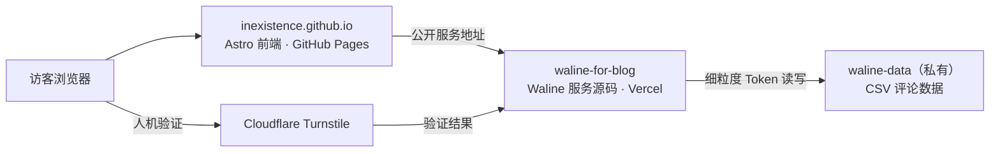

# 评论系统说明

INEXISTENCE 使用 Waline 提供文章评论和留言板。博客前端部署在 GitHub Pages，Waline 后端部署在 Vercel，评论数据存放在一个专用私有 GitHub 仓库。

## 架构与职责



| 位置 | 负责内容 | 可以保存的内容 |
| --- | --- | --- |
| `inexistence.github.io` | 博客页面、Waline 客户端样式与 GitHub Pages 发布 | `WALINE_SERVER_URL`、`TURNSTILE_SITE_KEY` 等公开值。 |
| `waline-for-blog` | Waline 服务源码、Vercel 部署与配置说明 | 不保存真实密钥。 |
| `waline-data`（私有） | `waline/*.csv` 评论、用户与计数数据 | 评论数据，不放前端代码或服务 Token。 |
| Vercel | 运行 Waline 服务 | `GITHUB_TOKEN`、`JWT_TOKEN`、`TURNSTILE_SECRET` 等私密变量。 |

数据流是：博客页面加载 Waline → Waline 接收留言并验证 Turnstile → Waline 使用细粒度 GitHub Token 写入私有 `waline-data` 仓库。访客和 GitHub Pages 均不会接触 GitHub Token。

## 配置顺序

1. 初始化私有 `waline-data` 仓库的 CSV 表头文件。
2. 在 Vercel 为 `waline-for-blog` 配置服务端环境变量并 Redeploy。
3. 在本仓库的 GitHub Actions Variables 配置公开的 Waline 服务地址和 Turnstile Site Key，重新部署 Pages。
4. 在文章页和 `/guestbook/` 分别提交一条测试留言，确认私有仓库写入正常。
5. 配置并验证 Turnstile 后，再清理仅用于评论的旧 Giscus Discussion、分类和 App 授权。

## 私有数据仓库

`waline-data` 必须是私有仓库。由于当前 `@waline/vercel` 的 GitHub 存储需要预先存在文件，请创建：

```text
waline/Comment.csv
objectId,user_id,comment,insertedAt,ip,link,mail,nick,pid,rid,status,ua,url,createdAt,updatedAt

waline/Counter.csv
objectId,time,url,createdAt,updatedAt

waline/Users.csv
objectId,display_name,email,password,type,url,avatar,label,github,twitter,facebook,google,weibo,qq,oidc,createdAt,updatedAt
```

创建 fine-grained GitHub Token 时，只选择 `inexistence/waline-data`，只授予 **Contents: Read and write**。该 Token 只保存到 Vercel 的 `GITHUB_TOKEN`，绝不能提交到任何仓库。

## Vercel 服务配置

在 `waline-for-blog` 的 Vercel 项目中，将以下变量添加到 **Production** 环境：

```text
GITHUB_REPO=inexistence/waline-data
GITHUB_TOKEN=<fine-grained-token>
GITHUB_PATH=waline
SITE_NAME=INEXISTENCE
SITE_URL=https://inexistence.github.io
SERVER_URL=https://waline-for-blog-rho.vercel.app
JWT_TOKEN=<high-entropy-random-string>
SECURE_DOMAINS=inexistence.github.io,waline-for-blog-rho.vercel.app
IPQPS=60
COMMENT_AUDIT=false
DISABLE_REGION=true
DISABLE_USERAGENT=true
TURNSTILE_KEY=<turnstile-site-key>
TURNSTILE_SECRET=<turnstile-secret-key>
```

- 不配置 SMTP：不发送邮件通知。
- `COMMENT_AUDIT=false`：评论立即公开。
- `IPQPS=60`：同一 IP 两次提交至少间隔 60 秒。
- 修改 Vercel 环境变量后，必须 Redeploy，设置才会生效。

## 博客前端配置

GitHub 仓库 **Settings → Secrets and variables → Actions → Variables** 中添加：

| Variable | 值 |
| --- | --- |
| `WALINE_SERVER_URL` | `https://waline-for-blog-rho.vercel.app` |
| `TURNSTILE_SITE_KEY` | Cloudflare Turnstile 的公开 Site Key |

上述值会在 GitHub Pages 构建时写入前端，因此只可放公开值。配置或变更后运行 `Deploy Astro site to Pages` 工作流。

本地预览使用：

```bash
cp .env.example .env
```

然后填写：

```text
PUBLIC_WALINE_SERVER_URL=https://waline-for-blog-rho.vercel.app
PUBLIC_TURNSTILE_SITE_KEY=<turnstile-site-key>
```

运行 `npm run dev` 后，可在文章页或 `http://localhost:4321/guestbook/` 查看。Waline 会自动允许 `localhost` 与 `127.0.0.1` 调用。

## 排障

| 现象 | 原因与处理 |
| --- | --- |
| `500 FUNCTION_INVOCATION_FAILED` | 检查 Vercel 的 `GITHUB_REPO`、`GITHUB_TOKEN`、`GITHUB_PATH`，保存后 Redeploy。 |
| `The "path" argument must be of type string` | Vercel 未配置 `GITHUB_PATH=waline`。 |
| `Received undefined` 或 Buffer 相关错误 | `waline-data` 中缺少预建的 CSV 文件，按上方表头创建三个文件。 |
| 页面显示“留言区正在准备中” | Pages 构建时没有 `WALINE_SERVER_URL`，检查 GitHub Actions Variables 后重新部署。 |
| 本地能显示但无法提交 | 检查 Waline 服务地址、Vercel 环境变量和浏览器开发者工具中的请求错误。 |

## 安全原则

- `GITHUB_TOKEN`、`JWT_TOKEN`、`TURNSTILE_SECRET` 只放 Vercel，不能写入代码、`.env.example`、README、GitHub Actions Variables 或截图。
- 细粒度 Token 只允许访问 `waline-data`，只授予 Contents 读写权限。
- `waline-data` 保持私有。
- 验证 Waline 的文章评论、留言板、Turnstile、管理员删除和私有数据写入全部正常后，再删除旧 Giscus 的评论数据与授权。
