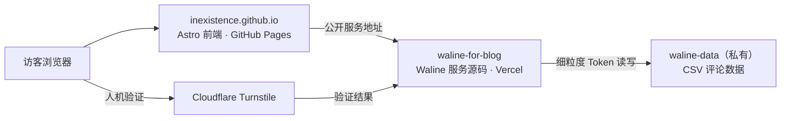

# 评论系统说明

INEXISTENCE 使用 Waline 提供文章评论和留言板。博客前端部署在 GitHub Pages，Waline 后端部署在 Vercel，评论数据存放在一个专用私有 GitHub 仓库。

日常操作、故障处理、密钥轮换和备份请参阅 [评论系统维护手册](comment-maintenance.md)。

## 架构与职责



| 位置 | 负责内容 | 可以保存的内容 |
| --- | --- | --- |
| `inexistence.github.io` | 博客页面、Waline 客户端样式与 GitHub Pages 发布 | `WALINE_SERVER_URL`、`TURNSTILE_SITE_KEY` 等公开值。 |
| `waline-for-blog` | Waline 服务源码、Vercel 部署与配置说明 | 不保存真实密钥。 |
| `waline-data`（私有） | `waline/*.csv` 评论、用户与计数数据 | 评论数据，不放前端代码或服务 Token。 |
| Vercel | 运行 Waline 服务 | `GITHUB_TOKEN`、`JWT_TOKEN`、`TURNSTILE_SECRET` 等私密变量。 |

数据流是：博客页面加载 Waline → Waline 接收留言并验证 Turnstile → Waline 使用细粒度 GitHub Token 写入私有 `waline-data` 仓库。访客和 GitHub Pages 均不会接触 GitHub Token。

## 配置顺序

1. 初始化私有 `waline-data` 仓库的 CSV 表头文件。
2. 在 Vercel 为 `waline-for-blog` 配置服务端环境变量并 Redeploy。
3. 从私有 `waline-data` README 的「维护入口」打开 Waline 管理后台，注册第一个账号；第一个账号自动成为管理员。
4. 在本仓库的 GitHub Actions Variables 配置公开的 Waline 服务地址和 Turnstile Site Key，重新部署 Pages。
5. 在文章页和 `/guestbook/` 分别提交一条测试留言，确认私有仓库写入正常。
6. 配置并验证 Turnstile 后，再清理仅用于评论的旧 Giscus Discussion、分类和 App 授权。

## 私有数据仓库

`waline-data` 必须是私有仓库。由于当前 `@waline/vercel` 的 GitHub 存储需要预先存在文件，请创建：

```text
waline/Comment.csv
objectId,user_id,comment,insertedAt,ip,link,mail,nick,pid,rid,status,ua,url,createdAt,updatedAt

waline/Counter.csv
objectId,time,url,createdAt,updatedAt

waline/Users.csv
objectId,display_name,email,password,type,url,avatar,label,github,twitter,facebook,google,weibo,qq,oidc,createdAt,updatedAt
```

创建 fine-grained GitHub Token 时，只选择 `inexistence/waline-data`，只授予 **Contents: Read and write**。该 Token 只保存到 Vercel 的 `GITHUB_TOKEN`，绝不能提交到任何仓库。

### GitHub CSV 存储的后台限制

GitHub CSV 是为了低维护、私有存储而选择的方案，适合当前低频、小规模的博客评论；它不是数据库。Waline 过去已有「CSV 已写入、前台可显示、但 `/ui/` 后台列表为空」的公开报告（[Issue #205](https://github.com/walinejs/waline/issues/205)、[Issue #152](https://github.com/walinejs/waline/issues/152)）。

本项目的 `waline-for-blog` 已固定 `@waline/vercel@1.41.3`，并用持久补丁修复其中一个明确的后台分页问题。补丁会在 Vercel 安装依赖时自动应用，相关文件、升级注意事项见服务仓库 README。它不能消除 GitHub API 的频率和文件大小限制；若评论量或后台管理频率明显增加，应改用数据库型存储。

### 岛民头像分配

匿名留言使用博客 `public/assets/avatars/` 中的岛民角色头像。Waline 服务端将规范化后的昵称与小写邮箱组合后计算 SHA-256 哈希，并从头像池稳定选择一张；昵称和邮箱均不变时，文章与留言板中始终显示相同头像，但邮箱不会发送给第三方头像服务。已注册用户在 Waline 后台单独设置的头像优先。

更新头像池时，先部署包含静态图片的 GitHub Pages，再部署 Waline 服务；头像文件名和服务仓库 `index.cjs` 的 `avatarFiles` 必须保持一致。

## Vercel 服务配置

在 `waline-for-blog` 的 Vercel 项目中，将以下变量添加到 **Production** 环境：

```text
GITHUB_REPO=inexistence/waline-data
GITHUB_TOKEN=<fine-grained-token>
GITHUB_PATH=waline
SITE_NAME=INEXISTENCE
SITE_URL=https://inexistence.github.io
SERVER_URL=https://waline-for-blog-rho.vercel.app
JWT_TOKEN=<high-entropy-random-string>
SECURE_DOMAINS=inexistence.github.io,waline-for-blog-rho.vercel.app
IPQPS=60
COMMENT_AUDIT=false
DISABLE_REGION=true
DISABLE_USERAGENT=true
TURNSTILE_KEY=<turnstile-site-key>
TURNSTILE_SECRET=<turnstile-secret-key>
```

- 不配置 SMTP：不发送邮件通知。
- `COMMENT_AUDIT=false`：评论立即公开。
- `IPQPS=60`：同一 IP 两次提交至少间隔 60 秒。
- 修改 Vercel 环境变量后，必须 Redeploy，设置才会生效。

## Cloudflare Turnstile

在 [Cloudflare Turnstile](https://dash.cloudflare.com/?to=/:account/turnstile) 创建一个 **Managed** 小组件，并添加以下 Hostnames（不填写 `https://` 或端口号）：

```text
inexistence.github.io
waline-for-blog-rho.vercel.app
localhost
```

创建后会得到 Site Key 和 Secret Key：

| 值 | 配置位置 | 是否公开 |
| --- | --- | --- |
| Site Key | Vercel 的 `TURNSTILE_KEY`、本仓库 GitHub Actions Variable `TURNSTILE_SITE_KEY`、本地 `.env` 的 `PUBLIC_TURNSTILE_SITE_KEY` | 可以公开 |
| Secret Key | 只放 Vercel 的 `TURNSTILE_SECRET` | 必须保密 |

保存 Vercel 变量后 Redeploy Waline；保存 GitHub Actions Variable 后重新运行 Pages 部署工作流。最后在文章页和 `/guestbook/` 各提交一条留言，确认验证码与写入均正常。

## 博客前端配置

GitHub 仓库 **Settings → Secrets and variables → Actions → Variables** 中添加：

| Variable | 值 |
| --- | --- |
| `WALINE_SERVER_URL` | `https://waline-for-blog-rho.vercel.app` |
| `TURNSTILE_SITE_KEY` | Cloudflare Turnstile 的公开 Site Key |

上述值会在 GitHub Pages 构建时写入前端，因此只可放公开值。配置或变更后运行 `Deploy Astro site to Pages` 工作流。

## 本地模拟与联调

本地测试分为三种层次；先选择所需层次，避免测试留言意外写入生产数据。

| 目的 | `PUBLIC_WALINE_SERVER_URL` | 是否会写入生产评论 |
| --- | --- | --- |
| 只检查博客布局、加载提示与样式 | 留空 | 否 |
| 本地前端联调线上 Waline | `https://waline-for-blog-rho.vercel.app` | 提交留言时会写入 |
| 完整隔离模拟 | 本机运行的 Waline 服务地址 | 否，前提是服务端使用独立测试存储 |

### 仅预览前端或联调线上服务

```bash
cp .env.example .env
npm run dev
```

只检查页面状态时，保持 `PUBLIC_WALINE_SERVER_URL` 为空；页面会显示“留言区正在准备中”，可验证缺少配置时不会发起请求。

如需在本地浏览器中连接已部署的服务，在 `.env` 填写：

```text
PUBLIC_WALINE_SERVER_URL=https://waline-for-blog-rho.vercel.app
PUBLIC_TURNSTILE_SITE_KEY=<turnstile-site-key>
```

运行 `npm run dev` 后，可在文章页或 `http://localhost:4321/guestbook/` 查看。Waline 会自动允许 `localhost` 与 `127.0.0.1` 调用。此方式的提交、验证码和头像均使用生产服务，留言会写入真实的 `waline-data`；只用于必要的联调，完成后应在后台删除测试留言。

### 完整隔离模拟

要验证提交、回复、管理员操作或服务端改动，应在 `waline-for-blog` 本地副本中运行服务，并为它配置**独立的测试数据仓库**；不要复制生产 `GITHUB_TOKEN`、`JWT_TOKEN` 或生产数据仓库地址。服务端本地配置至少应指向测试用的 `GITHUB_REPO`、`GITHUB_PATH=waline` 和独立的 `JWT_TOKEN`；若测试验证码，则使用 Turnstile 的测试密钥。

按服务仓库 README 中的本地开发命令启动该服务后，将本仓库 `.env` 改为其本机地址，例如：

```text
PUBLIC_WALINE_SERVER_URL=http://localhost:<waline-port>
PUBLIC_TURNSTILE_SITE_KEY=<turnstile-test-site-key>
```

随后运行 `npm run dev`，在文章页与 `/guestbook/` 各测试一次。确认无误后停止本地服务，并删除测试数据仓库中的测试评论；本地环境文件始终不提交。

## 排障

| 现象 | 原因与处理 |
| --- | --- |
| `500 FUNCTION_INVOCATION_FAILED` | 检查 Vercel 的 `GITHUB_REPO`、`GITHUB_TOKEN`、`GITHUB_PATH`，保存后 Redeploy。 |
| `The "path" argument must be of type string` | Vercel 未配置 `GITHUB_PATH=waline`。 |
| `Received undefined` 或 Buffer 相关错误 | `waline-data` 中缺少预建的 CSV 文件，按上方表头创建三个文件。 |
| CSV 已写入、前台可见，但 `/ui/` 评论列表为空 | 检查 Waline 服务仓库是否保留 `patches/@waline+vercel+1.41.3.patch`、`package-lock.json` 与 `postinstall` 脚本；推送后等待 Vercel 的新 Production 部署完成并强制刷新后台。 |
| 页面显示“留言区正在准备中” | Pages 构建时没有 `WALINE_SERVER_URL`，检查 GitHub Actions Variables 后重新部署。 |
| 本地能显示但无法提交 | 检查 Waline 服务地址、Vercel 环境变量和浏览器开发者工具中的请求错误。 |

## 安全原则

- `GITHUB_TOKEN`、`JWT_TOKEN`、`TURNSTILE_SECRET` 只放 Vercel，不能写入代码、`.env.example`、README、GitHub Actions Variables 或截图。
- 细粒度 Token 只允许访问 `waline-data`，只授予 Contents 读写权限。
- `waline-data` 保持私有。
- 验证 Waline 的文章评论、留言板、Turnstile、管理员删除和私有数据写入全部正常后，再删除旧 Giscus 的评论数据与授权。
